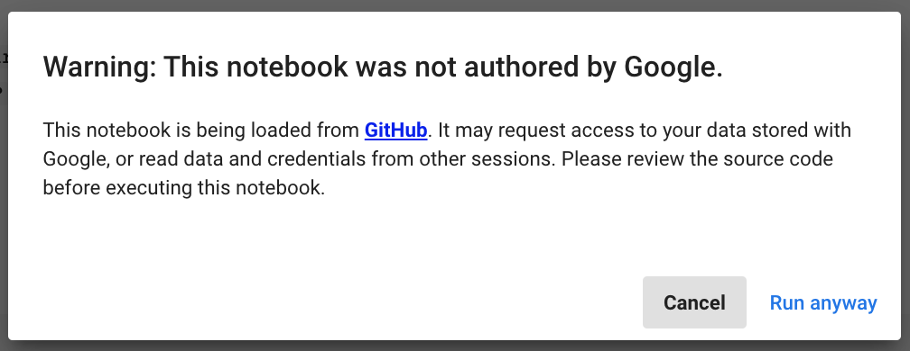
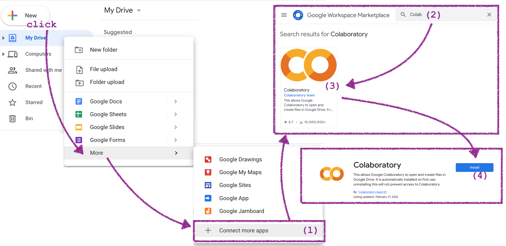

Ateliers de programmation Montréal-Python
=========================================

Ce dépôt git contient les notebooks de code pour les soirées de programmation
organisées par [Montréal-Python](https://montrealpython.org/en/).
Cliquez [ici](https://www.meetup.com/Montreal-Python/events/) pour voir les prochaines dates des événements.

Dans les ateliers, vous allez apprendre les notions de base de Python, qui 
est un langage de choix pour une personne commençant à programmer. Le but des
ateliers est de vous donner des bases de la programmation avec Python
ainsi que de vous donner des exemple concrets de projet d'analyse de données.


## Contenu

Tous les fichiers notebook se trouvent dans le sous-répertoire [`notebooks/`](./notebooks/).


### Quessé ça un notebook?

Les notebooks jupyter sont une façon de rouler du code Python de façon interactive.
Dans un notebook, nous écrivons notre code dans des cellules avant de demander à
l'ordinateur d'exécuter les instructions, c'est-à-dire de faire les actions décrites
dans le code. Pour exécuter le code d'une cellule, il faut placer son curseur sur
la cellule choisie et faire l'une des actions suivantes:
- appuyer sur les touches SHIFT et ENTER en même temps
- cliquer sur l'icône avec un triangle (play)

Le résultat des calculs ou commandes exécutées dans la cellule apparaîtra en dessous,
comme dans cet exemple:

```Python
 In[1]: x = 3

 In[2]: x*2
Out[2]: 6
```

L'interface notebook nous permet de mélanger du texte, du code et des graphiques,
ce qui en fait l'outil parfait pour la gestion et l'analyse des données et pour
l'apprentissage de la programmation.

Vous pouvez regarder les notebooks dans l'interface GitHub, télécharger les
fichiers notebooks (extension `.ipynb`) sur votre ordinateur et les rouler localement
ou encore mieux rouler les notebooks en ligne sans avoir à installer. Plus d'infos suivent.


## Rouler un notebook en ligne

Vous n'avez pas besoin de rien installer pour essayer les notebooks qui se trouvent
dans ce dépôt. Visitez la page [`notebooks/README.md`](./notebooks/README.md)
pour voir la liste de tous les notebooks. Pour chaque notebook, nous avons 
préparé des liens "launch binder" et "Open in Colab". 


### Option 1: Utiliser les liens "launch binder"

[Binder](https://mybinder.org/) est un service qui permet de rouler une instance
temporaire JupyterLab sur un ordinateur offert par des organisations comme
Google Cloud, OVH, GESIS Notebooks et Turing Institute.

Cliquez sur le bouton pour lancer une instance JupyterLab temporaire dans le cloud:  


Notez bien que:
- Binder fermera automatiquement les sessions utilisateur qui ont plus de 10 minutes
  d'inactivité (si vous laissez une fenêtre JupyterLab ouverte au premier plan,
  cela sera généralement compté comme "activité").
- Vous devez télécharger le notebook sur votre ordinateur si vous voulez garder
  les changements que vous y avez apporté.
  Utilisez le bouton download 
  pour télécharger le notebook en tant que fichier `.ipynb`.
  Lisez la section "Rouler un notebook localement" plus bas pour savoir quoi
  faire avec les fichiers `.ipynb`.


### Option 2: Utiliser les liens "Open in Colab"

Google Colab est un service offert qui permet de rouler les notebooks dans le cloud,
de les sauvegarder dans votre Google Drive et de les partager avec les autres,
d'où le nom "colab".

Cliquez sur le bouton pour ouvrir le fichier dans Google Colab:  


Lorsque vous roulez la première cellule de code, vous verrez un avertissement
qui vous préviens que rouler un notebook est équivalent à rouler un programme
et il faut donc pas rouler n'importe quoi sans avoir lu le code (au moins un peu).




## Rouler un notebook localement

Vous avez un fichier notebook (extension `.ipynb`) sur votre ordi et vous voulez
le rouler. Comment of fait?


### Utiliser JupyterLab Desktop

**JupyterLab Desktop** est une application tout-en-un pratique qui inclut Python et JupyterLab.
Vous pouvez télécharger **JupyterLab Desktop** à partir de la page suivante sur GitHub:
https://github.com/jupyterlab/jupyterlab-desktop#jupyterlab-desktop

Choisissez le lien de téléchargement correspondant à votre système d'exploitation.
Une fois l'installation terminée et que vous lancez l'application JupyterLab
et naviguer les répertoires de votre ordinateur pour trouver le notebook que vous
voulez exécuter.


### Installer JupyterLab avec pip

Cette option est pour les utilisateurs de Python avancés qui connaissent le terminal des commandes
et savent comment installer les librairies Python en utilisant `pip`.
Si ce n'est pas vous, utilisez l'option **JupyterLab Desktop** ci-dessus qui
vous évite tous ces étapes techniques.

Pour ceux/celles qui veulent savoir, les étapes pour installer jupyterlab avec
`pip` sont les suivantes:

- Download Python from https://www.python.org/downloads/
- Install on your computer
- Open command line (terminal)
- Create virtualenv called `venv` using the command `python -m virtualenv venv`
- Activate the virtualenv `source venv`
- Run `python -m pip install jupyterlab`
- Run `python -m pip install pandas requests beautifulsoup4 feedparser`
- Start JupyterLab by running `jupyter-lab`


### Utiliser Google Colab

1. Ajouter l'application Colab à votre Google Drive https://drive.google.com/
   en suivant les étapes dans l'image si dessous:
   

2. Ajouter le fichier notebook à votre Google Drive et cliquez dessus.
   Puisque dans l'étape 1 nous avons d'associé les fichiers `.ipynb` à Colab,
   le fichier ouvrira dans l'interface Colab.

Voir [cet article](https://ledatascientist.com/google-colab-le-guide-ultime/) pour plus d'infos.


## Créer un nouveau notebook

- Dans JupterLab, utilisez le bouton + our ouvrir le Launcher, et choisissez un notebook.
- Dans Google Colab, visitez https://colab.research.google.com/ et choisissez l'option "New Notebook"


